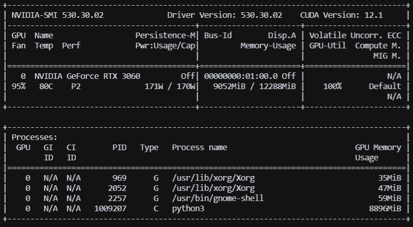
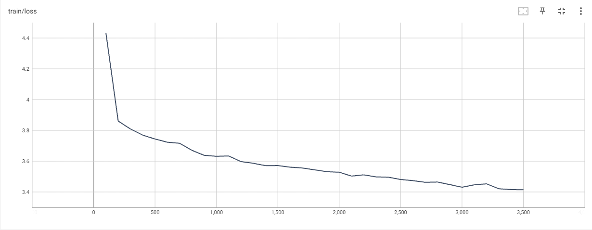
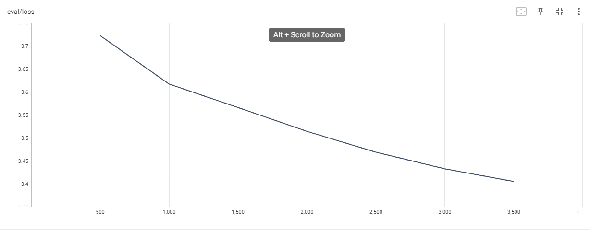

# ChatGLM-6B-QLoRA

## 介绍

本项目使用peft库，实现了ChatGLM-6B/chatGLM2-6B模型4bit的QLoRA高效微调，可以在一张RTX3060上完成全部微调过程。

内容包括：

1. 环境配置
2. 数据集介绍
3. ChatGLM-6B/chatGLM2-6B的QLoRA训练完整流程
4. ChatGLM-6B/chatGLM2-6B的推理流程
 
   - 使用adapter做推理
   - 合并adapter和basemodel做推理
   - 量化合并后的模型做推理
   
5. 推理性能测试

6. QLoRA微调前后的效果比对

特别说明：

无特别理由，强烈推荐使用chatGLM2-6B，理由如下：

1. chatGLM2-6B的推理效率比chatGLM-6B快30%~50%，见本文档`5. 推理性能测试章节`
2. chatGLM2-6B在微调前的输出质量就远高于chatGLM-6B，微调后的loss值更低
3. chatGLM2-6B几乎没有灾难性疑问的情况，微调后对数据集外的问题仍然能输出高质量的答案

但需要注意，chatGLM2-6B微调时显存占用较高，12G显存的情况下，`per_device_train_batch_size`只能设置为1，24G显存可以设置为4，相比chatGLM-6B要大很多。

推理时的显存占用二者并无太大差异。

## 环境配置

### 环境依赖

- CUDA >= 11.7

- python依赖项

    ```text
    transformers==4.30.0.dev0
    peft==0.4.0.dev0
    accelerate==0.20.0.dev0
    datasets==2.12.0
    tqdm==4.65.0
    loguru==0.7.0
    bitsandbytes==0.39.0
    cpm_kernels==1.0.11
    sentencepiece==0.1.99
    ```
  注意：其中带有dev0后缀的包，当前在各个pip源还无法索引到，可先安装低版本后再用以下命令升级，比如安装transformers==4.29.1，再执行以下第一条命令，peft和accelerate类似处理：
  ```shell
  pip install -q -U git+https://github.com/huggingface/transformers.git
  pip install -q -U git+https://github.com/huggingface/peft.git
  pip install -q -U git+https://github.com/huggingface/accelerate.git
  ```

### 推荐环境

推荐使用docker镜像，如下：

```shell
docker pull huggingface/transformers-pytorch-gpu:4.29.1
docker run -tid -v /your/data/path:/home -p 58323:58323 --gpus all huggingface/transformers-pytorch-gpu:4.29.1

# 上面命令中的 -p 58323:58323 如果你想用tensorboard查看训练过程，需要映射一个端口出来

# 进入容器
docker exec -ti container_name /bin/bash
```

进入容器后，执行：

```shell
python3 -m pip install --upgrade pip

pip install -q -U bitsandbytes
pip install -q -U git+https://github.com/huggingface/transformers.git
pip install -q -U git+https://github.com/huggingface/peft.git
pip install -q -U git+https://github.com/huggingface/accelerate.git
```

注：理论上更高版本的transformers库应该可以正常运行本项目。

## 数据集介绍

数据集使用ADGEN广告数据集，任务为根据instruction生成一段广告词，见本项目data文件夹，每条样本为一行，形式为：

```json
{
  "instruction": "类型#裤*版型#宽松*风格#性感*图案#线条*裤型#阔腿裤", 
  "output": "宽松的阔腿裤这两年真的吸粉不少，明星时尚达人的心头爱。毕竟好穿时尚，谁都能穿出腿长2米的效果宽松的裤腿，当然是遮肉小能手啊。上身随性自然不拘束，面料亲肤舒适贴身体验感棒棒哒。系带部分增加设计看点，还让单品的设计感更强。腿部线条若隐若现的，性感撩人。颜色敲温柔的，与裤子本身所呈现的风格有点反差萌。"
}
```

其中训练数据`train.jsonl`共计114599条，验证数据`dev.jsonl`共计1070条。

## 训练流程

进入本项目目录，训练启动命令如下：

```shell
python3 train_qlora.py \
--train_args_json chatGLM_6B_QLoRA.json \
--model_name_or_path THUDM/chatglm-6b \
--train_data_path data/train.jsonl \
--eval_data_path data/dev.jsonl \
--lora_rank 4 \
--lora_dropout 0.05 \
--compute_dtype fp32
```

训练chatGLM2-6B只要修改`model_name_or_path`参数为`THUDM/chatglm2-6b`.

其中`chatGLM_6B_QLoRA.json`文件为所有transformers框架支持的TrainingArguments，参考：https://huggingface.co/docs/transformers/main_classes/trainer#transformers.TrainingArguments

默认如下，可根据实际情况自行修改：

```json
{
    "output_dir": "saved_files/chatGLM_6B_QLoRA_t32",
    "per_device_train_batch_size": 4,
    "gradient_accumulation_steps": 8,
    "per_device_eval_batch_size": 4,
    "learning_rate": 1e-3,
    "num_train_epochs": 1.0,
    "lr_scheduler_type": "linear",
    "warmup_ratio": 0.1,
    "logging_steps": 100,
    "save_strategy": "steps",
    "save_steps": 500,
    "evaluation_strategy": "steps",
    "eval_steps": 500,
    "optim": "adamw_torch",
    "fp16": false,
    "remove_unused_columns": false,
    "ddp_find_unused_parameters": false,
    "seed": 42
}
```


对参数`compute_type`，可选`fp16`, `bf16`和`fp32`，实测使用`fp16`, `bf16`这两种计算速度有明显提升，相同的epoch只需要大约一半的时间，但出现loss收敛较慢的情况，默认选择`fp32`.

关于这个参数的选择，可能需要根据数据集做不同的尝试。

#### 训练截图（chatGLM-6B）

- 显存占用，batch_size = 4
  
  
  
  注：经过实测，chatGLM2-6B训练时的显存占用较大，建议用24G显存的显卡。默认配置下微调chatGLM2-6B，per_device_train_batch_size = 4时占用显存就达到21G左右，比chatGLM-6B大很多。

- chatGLM-6B的loss曲线，训练一个epoch，可以看到loss还在下降
    
  
  
  
  经过实测在训练一个epoch的情况下，chatGLM-6B的loss在3.4左右，chatGLM2-6B的loss可以到2.9

默认会在`saved_files/chatGLM_6B_QLoRA_t32`文件夹中生成一个`runs`的文件夹，可进入`saved_files/chatGLM_6B_QLoRA_t32`文件夹，用以下命令启动tensorboard，查看训练曲线：

```shell
tensorboard --logdir runs --port 'your port' --bind_all
```

## 模型推理

训练过程会保存adapter的checkpoint及最终的adapter文件，默认配置下chatGLM-6B每个文件的情况如下：

```text
-rw-r--r-- 1 root root  417 Jun  2 21:14 adapter_config.json
-rw-r--r-- 1 root root 7.1M Jun  2 21:14 adapter_model.bin
-rw-r--r-- 1 root root  15M Jun  2 21:14 optimizer.pt
-rw-r--r-- 1 root root  15K Jun  2 21:14 rng_state.pth
-rw-r--r-- 1 root root  627 Jun  2 21:14 scheduler.pt
-rw-r--r-- 1 root root 2.0K Jun  2 21:14 trainer_state.json
-rw-r--r-- 1 root root 3.9K Jun  2 21:14 training_args.bin
```

保存的adapter只有约7M的大小。

### 使用adapter推理

推理代码如下：

```python
import torch
from transformers import AutoModel, AutoTokenizer, BitsAndBytesConfig
from peft import PeftModel, PeftConfig


peft_model_path = 'saved_files/chatGLM_6B_QLoRA_t32'

config = PeftConfig.from_pretrained(peft_model_path)
q_config = BitsAndBytesConfig(load_in_4bit=True,
                              bnb_4bit_quant_type='nf4',
                              bnb_4bit_use_double_quant=True,
                              bnb_4bit_compute_dtype=torch.float32)

base_model = AutoModel.from_pretrained(config.base_model_name_or_path,
                                       quantization_config=q_config,
                                       trust_remote_code=True,
                                       device_map='auto')

input_text = '类型#裙*版型#显瘦*风格#文艺*风格#简约*图案#印花*图案#撞色*裙下摆#压褶*裙长#连衣裙*裙领型#圆领'
print(f'输入：\n{input_text}')
tokenizer = AutoTokenizer.from_pretrained(config.base_model_name_or_path, trust_remote_code=True)

response, history = base_model.chat(tokenizer=tokenizer, query=input_text)
print(f'微调前：\n{response}')

model = PeftModel.from_pretrained(base_model, peft_model_path)
response, history = model.chat(tokenizer=tokenizer, query=input_text)
print(f'微调后: \n{response}')
```

### 合并Lora model和base model、量化模型推理

首先需要说明，本项目目前使用的peft为dev的版本，在合并lora model和base model时，会报错，见https://github.com/huggingface/peft/pull/535

因此要完成模型的融合及量化，先将peft的版本回退到0.3.0，后期等稳定版的0.4.0放出后，应该不需要此步骤。

执行：

```shell
pip install peft==0.3.0
```

或者可以为此步骤单独建立一个python虚拟环境。

接下来执行脚本：

```shell
python3 merge_lora_and_quantize.py \
--lora_path saved_files/chatGLM_6B_QLoRA_t32 \
--output_path /tmp/merged_qlora_model_4bit \
--remote_scripts_dir remote_scripts/chatglm-6b \
--qbits 4
```

注意，请完整拷贝此项目，脚本运行时会将`remote_scripts_dir`文件夹中的所有chatGLM官方的脚本复制到最终输出的目录中，方便加载模型。

如果是合并chatglm2-6b则把参数`remote_scripts_dir`修改为`remote_scripts/chatglm2-6b`

运行完毕后，会输出：
```text
2023-06-07 07:04:34.139 | INFO     | __main__:main:57 - Lora model和base model成功merge, 并量化为4bits, 保存在/tmp/merged_qlora_model_4bit
```

表示模型完成合并和量化，最终保存的目录中各文件如下：

```text
-rw-r--r-- 1 root root  883 Jun  7 07:04 config.json
-rw-r--r-- 1 root root 4.3K Jun  7 07:04 configuration_chatglm.py
-rw-r--r-- 1 root root  147 Jun  7 07:04 generation_config.json
-rw-r--r-- 1 root root 2.6M Jun  7 07:04 ice_text.model
-rw-r--r-- 1 root root  59K Jun  7 07:04 modeling_chatglm.py
-rw-r--r-- 1 root root 3.7G Jun  7 07:04 pytorch_model.bin
-rw-r--r-- 1 root root  31K Jun  7 07:04 quantization.py
-rw-r--r-- 1 root root  125 Jun  7 07:04 special_tokens_map.json
-rw-r--r-- 1 root root  17K Jun  7 07:04 tokenization_chatglm.py
-rw-r--r-- 1 root root  495 Jun  7 07:04 tokenizer_config.json
```


可以用以下代码加载量化后的模型：

```python
from transformers import AutoModel, AutoTokenizer

model_path = '/tmp/merged_qlora_model_4bit'

tokenizer = AutoTokenizer.from_pretrained(model_path, trust_remote_code=True)
model = AutoModel.from_pretrained(model_path, trust_remote_code=True).half().cuda()

input_text = '类型#裙*版型#显瘦*风格#文艺*风格#简约*图案#印花*图案#撞色*裙下摆#压褶*裙长#连衣裙*裙领型#圆领'
response, history = model.chat(tokenizer=tokenizer, query=input_text)
print(response)
```

## 推理性能测试

对训练完的模型，我们和原始官方提供的模型进行性能对比，分为以下8种模型：

1. chatGLM-6B官方非量化模型，即`THUDM/chatglm-6b`
2. chatGLM-6B官方4bit量化模型，即`THUDM/chatglm-6b-int4`
3. qlora训练后的chatGLM-6B非量化模型，即运行以下命令得到的，记作`qlora-model`：
    ```shell
    python3 merge_lora_and_quantize.py \
    --lora_path saved_files/chatGLM_6B_QLoRA_t32 \
    --output_path /tmp/qlora-model \
    --remote_scripts_dir remote_scripts/chatglm-6b \
    --qbits 0
    ```
   注意，qbits参数不为4或8时，会在融合lora model和base model后，以非量化的方式保存fp16的模型。
4. qlora训练后的chatGLM-6B-4bit量化模型，即运行以下命令得到的，记作`qlora-model-4bit`：
    ```shell
    python3 merge_lora_and_quantize.py \
    --lora_path saved_files/chatGLM_6B_QLoRA_t32 \
    --output_path /tmp/qlora-model-4bit \
    --remote_scripts_dir remote_scripts/chatglm-6b \
    --qbits 4
    ```
5. chatGLM2-6B官方非量化模型，即`THUDM/chatglm2-6b`
6. chatGLM2-6B官方4bit量化模型，即`THUDM/chatglm2-6b-int4`
7. qlora训练后的chatGLM2-6B非量化模型，即运行以下命令得到的，记作`qlora-model2`：
    ```shell
    python3 merge_lora_and_quantize.py \
    --lora_path saved_files/chatGLM2_6B_QLoRA_t32 \
    --output_path /tmp/qlora-model2 \
    --remote_scripts_dir remote_scripts/chatglm2-6b \
    --qbits 0
    ```
8. qlora训练后的chatGLM2-6B-4bit量化模型，即运行以下命令得到的，记作`qlora-model-4bit2`：
    ```shell
    python3 merge_lora_and_quantize.py \
    --lora_path saved_files/chatGLM2_6B_QLoRA_t32 \
    --output_path /tmp/qlora-model-4bit2 \
    --remote_scripts_dir remote_scripts/chatglm2-6b \
    --qbits 4
    ``` 

我们对推理性能的测试，使用本项目的脚本：`inference_test.py`，统计单位时间内，模型能推理生成的token数量为衡量指标，详见代码逻辑。

代码运行方法：

```shell
python3 inference_test.py --model_path THUDM/chatglm-6b
```

测试的环境如下：

- cuda12
- RTX3090

经过测试，有如下结果：

chatGLM-6B:

|                | qlora-model-4bit | THUDM/chatglm-6b-int4 | qlora-model | THUDM/chatglm-6b |
|----------------|------------------|-----------------------|-------------|------------------|
| token_number/s | 18.93            | 16.93                 | 31.92       | 31.88            |
| gpu memory use |  6G              | 6G                    | 13G         | 13G              |

chatGLM2-6B:

|                | qlora-model-4bit2 | THUDM/chatglm2-6b-int4 | qlora-model2 | THUDM/chatglm2-6b |
|----------------|-------------------|------------------------|--------------|-------------------|
| token_number/s | 26                | 26                     | 47.95        | 47.94             |
| gpu memory use | 6G                | 6G                     | 13G          | 13G               |

结论：

1. 经过qlora训练后保存的模型，无论是否量化为4bit，推理速度与官方原始模型基本一致，chatGLM-6B的int4的略有提高
2. 4bit量化后的模型，推理效率均有明显降低，经过查阅资料，这里4bit的量化方法是一种以时间换空间的方法，具体见：https://huggingface.co/blog/zh/hf-bitsandbytes-integration
3. chatGLM2-6B相比chatGLM-6B的推理效率高了约30%~50%多

理论上qlora训练保存的adapter模型可以和原始模型合并后，再导入其他加速引擎进行加速。

## QLoRA微调前后推理对比

chatGLM-6B：

```text
输入：

类型#裙*版型#显瘦*风格#文艺*风格#简约*图案#印花*图案#撞色*裙下摆#压褶*裙长#连衣裙*裙领型#圆领

微调前输出：

* 版型：修身
* 显瘦：True
* 风格：文艺
* 简约：True
* 图案：印花
* 撞色：True
* 裙下摆：直筒或微喇
* 裙长：中长裙
* 连衣裙：True

微调后输出：

一款简约而不简单的连衣裙，采用撞色的印花点缀，打造文艺气息，简约的圆领，修饰脸型。衣袖和裙摆的压褶，增添设计感，修身的版型，勾勒出窈窕的身材曲线。
```

chatGLM2-6B：

```text
输入：
类型#裙*版型#显瘦*风格#文艺*风格#简约*图案#印花*图案#撞色*裙下摆#压褶*裙长#连衣裙*裙领型#圆领

微调前：
这款裙子,版型显瘦,采用简约文艺风格,图案为印花和撞色设计,裙下摆为压褶裙摆,裙长为连衣裙,适合各种场合穿着,让你舒适自在。圆领设计,优雅清新,让你在任何场合都充满自信。如果你正在寻找一款舒适、时尚、优雅的裙子,不妨 考虑这款吧!

微调后: 
这款连衣裙简约的设计，撞色印花点缀，丰富了视觉，上身更显时尚。修身的版型，贴合身形，穿着舒适不束缚。圆领的设计，露出精致锁骨，尽显女性优雅气质。下摆压褶的设计，增添立体感，行走间更显飘逸。前短后长的设计，显 得身材比例更加完美。文艺的碎花设计，更显精致。
```

可以看到chatGLM2-6B在微调前的输出就远好于chatGLM-6B.

#### 关于灾难性遗忘

看到很多朋友表示微调后的模型出现灾难性疑问的问题，无法对微调数据集以外的问题进行正常反应，我对微调后的模型进行了一些其他问题的测试。

对chatGLM2-6B，微调后，几乎不存在灾难性疑问，对于数据集以外的问题也可以进行高质量的回答。

chatGLM-6B在多次测试中发现遗忘情况出现较少，但有时会出现输出<unk>的异常情况。

以下是一些正常响应和异常响应的例子：

正常响应：

```text
输入：输出一份黄山旅游的计划

输出：

黄山作为中国著名的风景区之一，吸引着众多游客前来游览。以下是一份黄山旅游的计划，供您参考。

第一天：抵达黄山市，然后前往黄山风景区，游览黄山风景区，可以游览黄山的“四绝”，即云海、云松、雾海、雾松。
第二天：游览黄山松林，可以游览黄山的松林，可以体验黄山松林的秀丽。
第三天：游览黄山市区，可以游览黄山市区，可以游览黄山市区的景点。
```

```text
输入：大众汽车怎么样？

输出：

大众是一辆全球都受欢迎的品牌，它拥有众多经典款式，无论是城市驾驶还是城市购物，它都是一把好手。它拥有出色的操控性能，同时拥有舒适的驾驶体验。它拥有良好的燃油性能，拥有良好的耐用性。
```

```text
输入：下雨天骑电瓶车有哪些需要注意的问题？

输出：

骑电瓶车的时候需要注意以下几个方面的问题，这样保证能够安全出行：

1. 下雨天，骑电瓶车需要防止滑倒，因为下雨天，电瓶车会很容易滑倒，所以骑电瓶车时需要注意保持平衡，并且不要骑得过快，这样可以保证安全。

2. 下雨天，骑电瓶车时需要防止被雨淋湿，因为被雨淋湿之后会对身体造成伤害，所以骑电瓶车时需要防止淋雨，并且要穿防水衣。

3. 骑电瓶车时需要注意保护自己的脖子，因为脖子比较脆弱，容易被压到，所以骑电瓶车时需要注意保护脖子。
```

异常响应，和以上正常响应一样的问题，多运行几次，会出现以下异常：

```text
输入：大众汽车怎么样？

输出：

大众是德国品牌，在汽车界有着深厚的历史，拥有德国车严谨的工艺精神，是<UNK>的<UNK>。作为<UNK>，它的设计简单大方，没有多余的装饰，但经典的造型却能够让你<UNK>其中，它的性能也非常出色，具有<UNK>的能力。
```

## 参考

- https://github.com/THUDM/ChatGLM-6B
- https://huggingface.co/blog/4bit-transformers-bitsandbytes
- https://huggingface.co/blog/zh/hf-bitsandbytes-integration
- https://github.com/mymusise/ChatGLM-Tuning
